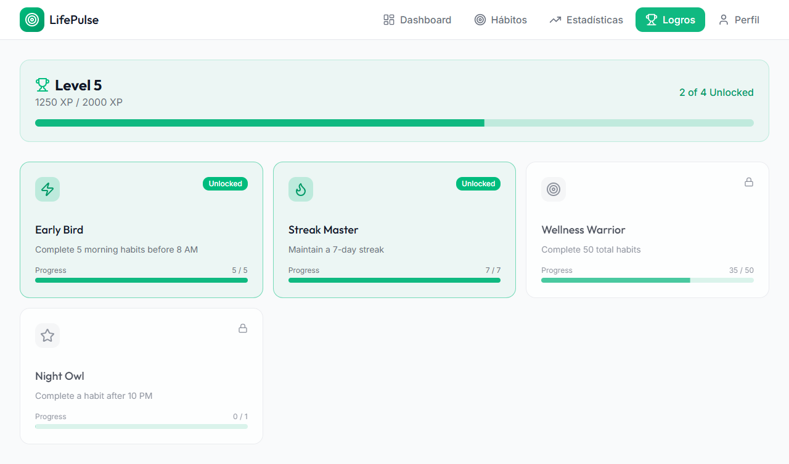

# Habit & Wellness Tracker 🌿

**LifePulse** es una aplicación web integral diseñada para ayudarte a construir, rastrear y mantener hábitos saludables, mejorando tu bienestar general día a día.


## 📋 Descripción

LifePulse ofrece una interfaz moderna e intuitiva para la gestión de hábitos y el seguimiento del bienestar personal. Desarrollada con tecnologías web de última generación, esta aplicación permite a los usuarios establecer metas diarias, visualizar su progreso a través de estadísticas detalladas y mantenerse motivados mediante un sistema de gamificación y logros.

### Características Principales

*   **Dashboard Interactivo**: Vista general de tu progreso diario, racha actual y puntos totales.
*   **Gestión de Hábitos**: Crea, edita y elimina hábitos personalizados. Clasifícalos por frecuencia (diaria, semanal).
*   **Seguimiento de Estadísticas**: Gráficos visuales de tu rendimiento, tasa de éxito y consistencia mensual.
*   **Sistema de Logros**: Desbloquea medallas y sube de nivel a medida que cumples tus objetivos.
*   **Perfil de Usuario**: Visualiza tu historial de actividad y nivel de usuario.
*   **Diseño Responsive**: Experiencia fluida en dispositivos de escritorio y móviles.

## 🚀 Tecnologías y Requisitos

El proyecto está construido con el siguiente stack tecnológico:

*   **Frontend**: React + TypeScript + Vite
*   **Estilos**: Tailwind CSS
*   **Componentes UI**: Shadcn/ui (basado en Radix UI)
*   **Iconos**: Lucide React
*   **Gráficos**: Recharts
*   **Animaciones**: Framer Motion
*   **Notificaciones**: Sonner

### Requisitos del Sistema

*   Node.js (versión 18 o superior)
*   npm, pnpm o yarn

## 🔧 Instalación

Sigue estos pasos para ejecutar el proyecto localmente:

1.  **Clonar el repositorio**
    ```bash
    git clone https://github.com/Miguel-Gonzalez18/Habit-Wellness-Tracker.git
    cd Habit-Wellness-Tracker
    ```

2.  **Instalar dependencias**
    ```bash
    npm install
    # o
    pnpm install
    ```

3.  **Iniciar el servidor de desarrollo**
    ```bash
    npm run dev
    # o
    pnpm dev
    ```

4.  **Abrir en el navegador**
    Visita `http://localhost:5173` para ver la aplicación.

## 📖 Guía de Uso

### 1. Dashboard
El panel principal te da la bienvenida y muestra un resumen rápido de tu día.


### 2. Gestión de Hábitos
Ve a la pestaña "Hábitos" para añadir nuevas metas. Haz clic en "Nuevo Hábito", elige un icono, nombre y frecuencia.


### 3. Estadísticas
Analiza tu rendimiento en la pestaña "Estadísticas". Observa tu tasa de éxito y la distribución de tus actividades.


### 4. Logros y Perfil
¡Mantén la motivación! Revisa tus logros desbloqueados y tu nivel actual en las secciones correspondientes.



## 📄 Licencia

Este proyecto está bajo la Licencia MIT. Consulta el archivo `LICENSE` para más detalles.

Copyright (c) 2025 Miguel Ángel González

## 📞 Contacto y Soporte

Si tienes alguna pregunta o sugerencia, no dudes en contactar:

*   **Email**: axtra2766@gmail.com
*   **GitHub**: [Miguel-Gonzalez18](https://github.com/Miguel-Gonzalez18)

---
*Construido con ❤️ para mejorar tu bienestar.*
